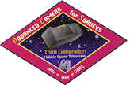

 

# ACS Notebooks

This directory contains Jupyter notebooks to demonstrate how to calibrate and analyze data from the *Hubble Space Telescope* (*HST*) Advanced Camera for Surveys (ACS). Users are advised to visit the [ACS website](http://www.stsci.edu/hst/acs), [Instrument Handbook](http://www.stsci.edu/hst/acs/documents/handbooks/current/cover.html), and [Data Handbook](http://www.stsci.edu/hst/acs/documents/handbooks/currentDHB/acs_cover.html) for more information about the current status of ACS, instrument specifications, and data analysis.

If you have questions about HST data analysis, calibration software, instrument capabilities, and/or the methods discussed in this repository, please visit the [HST Help Desk](http://hsthelp.stsci.edu). Through the help desk portal, you can explore the HST Knowledge Base and request additional help from experts.

Jupyter Notebooks allow code to be packaged with formatted text to create illustrative examples. Users who are unfamiliar with Jupyter Notebooks should also see the [short guide](https://jupyter-notebook-beginner-guide.readthedocs.io/en/latest/) for how to use these tools.

## Before Running a Notebook
Before running these examples, you **must** follow the general instructions on creating an environment that can run the notebooks, shown in STScI HST Notebook Repository HQ page under [**Installation Instructions**](https://spacetelescope.github.io/hst_notebooks/index.html).

## Contents

### Simple Example Notebooks

* [**acs_subarrays**](https://spacetelescope.github.io/hst_notebooks/notebooks/ACS/acs_subarrays/acs_subarrays.html): Instructions for how to use the `acstools.acs_destripe_plus` module to calibrate, de-stripe, and correct ACS subarray observations for charge transfer efficiency (CTE). Also included are instructions for updating the `OSCNTAB` reference file to subtract the bias level from the prescan columns in user-defined subarray observations.

* [**acs_pixel_area_maps**](https://spacetelescope.github.io/hst_notebooks/notebooks/ACS/acs_pixel_area_maps/acs_pixel_area_maps.html): This notebook shows how to use Python to create pixel area maps (PAMs) to account for the effects of geometric distortion in distorted images. This enables users to perform photometry on distorted images.

* [**acs_polarization_tools**](https://spacetelescope.github.io/hst_notebooks/notebooks/ACS/acs_polarization_tools/acs_polarization_tools.html): ACS/WFC offers two sets of polarizers, UV and visible, for imaging polarimetry and imaging spectropolarimetry. This notebook provides guidance on using the `acstools.polarization_tools` module to retrieve polarization calibration coefficients and calculate polarization properties of a source.

* [**acs_exception_report**](https://spacetelescope.github.io/hst_notebooks/notebooks/ACS/acs_exception_report/exception_report_checks.html): This notebook provides a step-by-step guide for examining your ACS data and observing logs to identify potential data quality issues via an HST Exception Report, and outlines the process for deciding whether a HOPR or Help Desk ticket is warranted. 

### Complex Workflow Notebooks

* [**acs_reduction**](https://spacetelescope.github.io/hst_notebooks/notebooks/ACS/acs_reduction/acs_reduction.html): This worked example demonstrates how to use the CALACS pipeline to re-process raw ACS data retrieved from MAST. Users are shown how to update reference files in the image headers, retrieve reference files from the Calibration Reference Data System (CRDS), and how to toggle steps in the calibration pipeline (e.g., CTE correction).

* [**acs_cte_forward_model**](https://spacetelescope.github.io/hst_notebooks/notebooks/ACS/acs_cte_forward_model/acs_cte_forward_model_example.html): The capability to simulate the readout of an ACS image at a given epoch is a feature of CALACS that does not run during standard calibration. This example demonstrates how to take a pristine image, or one corrected for time-dependent CTE loss, and simulate CTE losses for an arbitrary observation date using `acstools.acscteforwardmodel`.

* [**acs_saturation_trails**](https://spacetelescope.github.io/hst_notebooks/notebooks/ACS/acs_saturation_trails/acs_saturation_trails.html): The ACS/WFC CCDs remain linear beyond the full-well saturation, which allows users the opportunity to perform photometry on saturated stars. This notebook demonstrates the methods and caveats when performing saturated star photometry.

* [**acs_sbc_dark_analysis**](https://spacetelescope.github.io/hst_notebooks/notebooks/ACS/acs_sbc_dark_analysis/acs_sbc_dark_analysis.html): The ACS Solar Blind Channel (SBC) has nominally negligible dark current. However, the temperature of the SBC detector increases steadily over time while it is in use, and the dark current is proportional to temperature. At temperatures above 25 ºC, the dark current is no longer negligible and must be subtracted. This workflow demonstrates how to account for dark current in ACS/SBC observations.

* [**acs_findsat_mrt_example**](https://spacetelescope.github.io/hst_notebooks/notebooks/ACS/acs_findsat_mrt/acs_findsat_mrt_example.html): ACS/WFC imaging data is often affected by contamination by artificial satellites, compromising science data. The `acstools.findsat_mrt` module can be used to identify satellite trails and create masks to reject affected pixels from further analysis.

* [**acs_focus_diverse_epsfs**](https://spacetelescope.github.io/hst_notebooks/notebooks/ACS/acs_focus_diverse_epsfs/acs_focus_diverse_epsfs.html): This notebook provides instructions on using the `acstools.focus_diverse_epsfs` module to retrieve empirical, focus-diverse ePSFs for ACS/WFC data. 

* [**hst_orbits_ephem**](https://spacetelescope.github.io/hst_notebooks/notebooks/ACS/hst_orbits_ephem/hst_orbits_ephem.html): Instructions on how to obtain information about HST’s location and pointing direction relative to Earth and the Sun for a given observation.

## Contributing

New contributions and feedback are very welcomed! Please open a new [issue](https://github.com/spacetelescope/hst_notebooks/issues) or new pull request for bugs, feedback, or new features you would like to see. If there is an issue you would like to work on, please leave a comment and we will be happy to assist. Questions can also be sent to the ACS team through the [HST Help Desk](https://stsci.service-now.com/hst).
